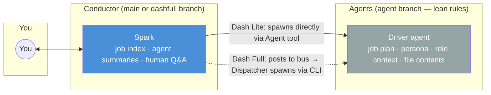

# Getting Started with Spark

> Spark is a portable AI orchestration framework for Claude Code. It manages persistent sessions, autonomous agents, and structured workflows — for software development, infrastructure, documentation, operations, or any project-based work.

## What Spark Does

Without Spark, each Claude Code session is a blank slate. You explain context, give instructions, lose progress when the session ends, and start over next time.

With Spark:
- **Sessions persist** — Spark remembers what happened and picks up where you left off
- **Work is organized** — Jobs have plans, acceptance criteria, and tracked status
- **Agents are managed** — Complex work gets delegated to specialized agents that work autonomously
- **Context stays clean** — The conductor (Spark) stays lean while agents handle the details
- **Teams can share** — Framework, personas, and work plans live in version control

## Installation

### Mac / Linux

```bash
git clone https://github.com/SPNilsen/Claude-Spark.git ~/spark
cd your-project
~/spark/install.sh
```

### Windows (no Git Bash required)

```cmd
git clone https://github.com/SPNilsen/Claude-Spark.git %USERPROFILE%\spark
cd your-project
node %USERPROFILE%\spark\install.js
```

Both produce identical results — `.claude/` with the framework config, agents, templates, and a `.gitignore`.

> **Quick version:** See `.claude/quickstart.md` for a 1-page get-running guide.

### Dispatch

Spark dispatches agents via native subagents (the Agent tool). No external dependencies needed — works with any Claude Code setup.

### Claude Subscription

Spark works with **any Claude subscription** — Free, Pro, or Max. For the best experience:

| Plan | Works? | Best for |
|------|--------|----------|
| Free | ✅ | Learning the SPARK Method, small projects |
| Pro ($20/mo) | ✅ | Solo development, single-session workflows |
| Max x5 ($100/mo) | ✅ | Active development, occasional multi-session |
| **Max x20 ($200/mo)** | ✅ Recommended | Multi-session solo mode, heavy dispatch, setlist execution |

Multi-account solo mode (solobot-1, solobot-2) multiplies your token budget — each account has its own allowance. Max x20 gives the most headroom per session.

### How Spark Fits Into Your Workflow

**Two parts:** The Spark repo is the engine (rules, commands, agents). Your project holds state (bus, jobs, session, roles). You launch Claude Code from the Spark repo and point it at your project.

```
~/spark/                   <- the engine (launch from here)
~/spark/.claude/           <- rules, commands, agents auto-load
~/projects/my-api/          <- your project
~/projects/my-api/.claude/  <- project state (bus, jobs, session)
```

**Where to start Claude Code:** Always start Claude Code FROM the Spark repo directory. Tell Spark which project to work on.

```bash
cd ~/spark
claude
> Working on ~/projects/my-api. I'm deven, go.
```

**One install per project.** Each project gets its own state directory via `install.sh`. Projects don't share state, but they all use the same Spark engine.

**Solo multi-session:** Open multiple terminals, all `cd` into the Spark repo. Each runs `claude` independently and targets the same project. The project bus coordinates between them.

```bash
# Terminal 1 (lead)
cd ~/spark && claude
> Working on ~/projects/my-api. I'm deven, go.

# Terminal 2 (bot)
cd ~/spark && claude
> Working on ~/projects/my-api. I'm solobot-1, go.

# Terminal 3 (bot)
cd ~/spark && claude
> Working on ~/projects/my-api. I'm solobot-2, go.
```

**Framework updates:** `cd ~/spark && git pull` — that's it. Rules, commands, and agents update instantly for all projects.

### After installation

```bash
cd ~/spark && git checkout dashlite && claude    # or dashfull
> Working on ~/projects/my-api. Fresh start.
```

Spark will:
1. Detect your project type (code, documentation, infrastructure, mixed, or non-technical)
2. Run discovery agents to understand your project
3. Ask targeted questions about your workflow and goals
4. Generate role context files tailored to your stack
5. Scaffold the working directories

---

## Quick Start by Project Type

### Software Development
```
> Working on ~/projects/my-api. Fresh start.
```
Spark scans your codebase, identifies languages/frameworks/tools, and configures itself. You'll get roles like `backend`, `frontend`, `testing` auto-generated.

### Network Engineering / Infrastructure
```
> Working on ~/projects/my-network. Fresh start.
```
Spark detects config files, automation tools, and topology. During onboarding it asks about your workflow (discover → analyze → implement → verify) and sets quality gates for config validation and compliance.

### Documentation / Writing
```
> Working on ~/projects/my-docs. Fresh start.
```
Spark detects existing docs, identifies the structure, and asks about your publishing workflow. Quality gates become "reviewed by approver" and "links validated" instead of "tests pass."

### Any Other Work
```
> Working on ~/projects/my-work. Fresh start.
```
Spark asks what you do and how your work flows. It adapts job templates, quality gates, and roles to match your process — even if it's not technical.

### What "Fresh Start" Looks Like

Here's what a typical fresh start conversation looks like for a software project:

```
You:   Working on ~/projects/my-api. Fresh start.

Spark: Good morning. I'll get oriented with your project.

       [Spawns discovery agent — scans directory structure, languages, configs]

       Here's what I found:
       - Language: Python 3.12
       - Framework: FastAPI + SQLAlchemy async
       - Database: PostgreSQL (docker-compose.yml)
       - Tests: pytest (347 tests in tests/)
       - CI: GitHub Actions (.github/workflows/)
       - Frontend: Vanilla JS + Tailwind CSS

       A few questions to dial things in:

       1. What's your branching model?
          (Git Flow / trunk-based / something else)
       2. Do you have a staging environment, or just local + prod?
       3. Any conventions I should know about?
          (naming, PR format, commit style, etc.)

You:   Git flow. Local and prod only. We use conventional commits.

Spark: Got it. Generating role context files...

       [Spawns role-generation agents for backend, frontend, testing, infrastructure]

       Created:
       - .claude/roles/backend.md    (FastAPI, SQLAlchemy async, Pydantic)
       - .claude/roles/frontend.md   (Vanilla JS, Tailwind, component patterns)
       - .claude/roles/testing.md    (pytest, 347 tests, async patterns)
       - .claude/roles/infrastructure.md (Docker, GitHub Actions, PostgreSQL)

       Scaffolded:
       - .claude/jobs/         (work plans)
       - .claude/session/      (handoff, questions)
       - .claude/setlists/     (batch orchestration)
       - .claude/research/     (analysis docs)
       - .claude/reference/    (stable project docs)

       Ready. What are we working on?
```

For a network engineering project, the conversation adapts:

```
You:   Working on ~/projects/my-network. Fresh start.

Spark: I'll get oriented.

       [Scans project — finds Ansible playbooks, Jinja2 templates, YAML inventories]

       Here's what I found:
       - Automation: Ansible 2.15 (42 playbooks)
       - Templates: Jinja2 (Cisco IOS, Arista EOS)
       - Inventory: YAML-based, grouped by site
       - Version control: Git (no CI detected)

       Questions:

       1. What's your change workflow?
          (discover → analyze → implement → verify / something else)
       2. Do configs go through a review/approval gate?
       3. Any compliance baselines I should know about?
          (CIS, NIST, internal standard, etc.)

You:   Standard 4-phase. All changes need peer review. We follow CIS benchmarks.

Spark: Got it. Generating role context...

       Created:
       - .claude/roles/network-engineer.md  (Ansible, IOS/EOS, Jinja2)
       - .claude/roles/security.md          (CIS benchmarks, compliance)

       Quality gates set to: peer review + config validation + compliance check.
       Ready. What are we working on?
```

---

## Core Workflow

### Starting a session

| What you say | What happens |
|-------------|-------------|
| `Working on ~/my-project` | Sets the project directory. Waits for your instruction. |
| `/go` | Reads the bus and handoff. Resumes work. |
| `/init` | Runs the training sequence for a new project. |

### During a session

| What you say | What happens |
|-------------|-------------|
| `/assign job-5 to solobot-1` | Assigns work to a named dev session. They pick it up on `/go`. |
| `/harvest` | Pulls context from git, Jira, Slack, Confluence into `.claude/context/`. |
| `Spark, dispatch job-5` | Spawns an autonomous agent to work on job-5 in the background. |
| `Spark, /setlist 3` | Executes all jobs in setlist 3, sequentially, autonomously. |
| `Spark, spec job-5` | Contract-first: interviews you, writes tests, then Builder makes them green. |
| `Spark, checkpoint` | Saves current progress. Keeps working. |
| `Spark, status` | Shows project status: jobs done, in progress, blocked. |
| `Spark, what's on deck?` | Shows the next jobs to be done. |
| `/status` | Shows active deliveries, dispatch health, pending pickups. |
| `/scan` | Xray security scan on uncommitted changes (OWASP + Spark checks). |
| `/scan job-5` | Xray scan on files changed by a specific job. |

### Ending a session

| What you say | What happens |
|-------------|-------------|
| `Spark, /wrap` | Saves state, writes kickoff for next session, stops. |

### Personas and customization

| What you say | What happens |
|-------------|-------------|
| `Spark, /cast` | Generate a custom persona from a resume, bio, or description. |
| `Spark, cast me` | Same as `/cast` — creates a persona based on your profile. |
| `Spark, /refresh` | Re-scans your project and updates role context files. |
| `Spark, imprint` | Interview to learn your coding style and preferences. Agents use it automatically. |
| `/tune backend` | Customize a core persona with project-specific addendum. |
| `/allow Bash(npm test)` | Permanently approve a tool so it won't prompt again. |

### Framework management

| What you say | What happens |
|-------------|-------------|
| `Spark, /upstream` | Diff local framework changes, stage improvements for PR back to Spark repo. |
| `Spark, /updates` | Compare installed version against source repo, show what's new. |

### Housekeeping

| What you say | What happens |
|-------------|-------------|
| `Spark, flush` | Clears session state (handoff, questions). Keeps jobs and framework. |
| `Spark, flush jobs` | Clears all job plans and setlists. Keeps framework. |
| `Spark, flush all` | Nuclear reset. Only keeps `spark.md` itself. |

### Session naming

After Spark starts or resumes, it suggests a `/rename` command:
```
Suggested: /rename S12-Setlist-3-Auth-Migration
```
Run this to name your session for easy history tracking.

---

## Key Concepts

### Jobs
A job is a unit of work. It has:
- A **plan** (what to do, broken into steps)
- **Acceptance criteria** (how to know it's done)
- A **role** (which skill domain it belongs to)
- **Story points** (size estimate — affects budget and strategy)
- **Dependencies** (which jobs must complete first)

Jobs live in `.claude/jobs/` as markdown files. They're tracked in `.claude/jobs/INDEX.md`.

Job structure adapts to your work type:
- **Software**: Stories with implementation and tests
- **Network/Infra**: Phases — discovery, analysis, implementation, verification
- **Documentation**: Sections — research, draft, review
- **Operations**: Steps — intake, triage, execute, validate

### Setlists

A setlist is an ordered batch of jobs — think of it as a sprint or a release train. Setlists let you queue up a sequence of work and let Spark execute it autonomously.

#### Creating a setlist

You can ask Spark to create one, or write it yourself:

```
> Spark, plan a setlist for the auth migration
```

Spark will review your job index, identify related jobs, order them by dependency, and propose a setlist for your approval.

To write one manually, create a markdown file in `.claude/setlists/`:

```markdown
# Setlist 3: Authentication Migration

## Jobs (in order)
1. job-5-auth-middleware (3 SP) — backend
2. job-6-login-endpoint (5 SP) — backend
3. job-7-session-management (3 SP) — backend
4. job-8-auth-frontend (5 SP) — frontend
5. job-9-auth-tests (3 SP) — testing

## Total: 19 SP

## Notes
- Jobs 5-7 must run sequentially (dependencies)
- Job 8 can start after job 6 completes
- Job 9 runs last (needs all auth code in place)
```

#### Running a setlist

```
> Spark, /setlist 3
```

Spark will:
1. Read the setlist and verify all jobs exist
2. Check dependencies — ensure prerequisite jobs are complete
3. Dispatch jobs one at a time (or in parallel where dependencies allow)
4. Checkpoint progress after each job completes
5. Surface any blockers or questions from agents
6. Report final status when the setlist is done

You can check progress anytime:
```
> Spark, status
```
```
Setlist 3 — Authentication Migration
  ✓ job-5-auth-middleware       complete (3 SP)
  ✓ job-6-login-endpoint        complete (5 SP)
  ► job-7-session-management    in progress (3 SP)
  · job-8-auth-frontend         waiting on job-6 ✓
  · job-9-auth-tests            pending
Progress: 8/19 SP (42%)
```

#### Setlist examples by domain

**Network engineering setlist:**
```markdown
# Setlist 5: Campus Switch Hardening

## Jobs (in order)
1. job-12-compliance-audit (5 SP) — network-engineer
2. job-13-remediation-configs (8 SP) — network-engineer
3. job-14-change-review (3 SP) — security
4. job-15-staged-deployment (5 SP) — infrastructure

## Quality gates
- Each config validated against CIS baseline before next phase
- Peer review required between job-13 and job-14
```

**Documentation setlist:**
```markdown
# Setlist 2: API Documentation Sprint

## Jobs (in order)
1. job-8-api-reference (8 SP) — writing
2. job-9-getting-started-guide (5 SP) — writing
3. job-10-example-collection (5 SP) — writing
4. job-11-link-validation (2 SP) — testing

## Quality gates
- Each doc reviewed for accuracy against live API
- All code examples must execute successfully
```

**Operations setlist:**
```markdown
# Setlist 1: Onboarding Automation

## Jobs (in order)
1. job-1-audit-current-process (3 SP) — research
2. job-2-design-automation (5 SP) — architect
3. job-3-build-runbooks (8 SP) — writing
4. job-4-test-runbooks (3 SP) — testing
```

### Roles (Two-Layer System)
Each agent gets two layers of context:

**Personas** (in the Spark repo at `.claude/agents/`) — How the agent *thinks*. Portable across projects.
- Defines thinking style, approach patterns, quality instincts
- Example: the `backend` persona thinks about data models first, always considers N+1 queries
- 14 core personas ship with the framework
- You can create custom personas from resumes or descriptions

**Project Context** (`.claude/roles/`) — What the agent *works with*. Project-specific.
- Defines the tech stack, conventions, key paths, quality gates for this project
- Auto-generated during `/init`, updated with `/refresh`
- Example: "backend in this project means FastAPI + SQLAlchemy async + PostgreSQL"

When an agent is dispatched, it reads both layers: the persona shapes *how* it thinks, the role context tells it *what* it's working with.

### Personas — Core Library

| Persona | Focus |
|---------|-------|
| `backend` | Server-side logic, APIs, data models |
| `frontend` | UI components, state management, accessibility |
| `infrastructure` | Docker, CI/CD, deployment, automation |
| `security` | Vulnerabilities, auth, compliance, OWASP |
| `testing` | Test strategy, coverage, mocking, assertions |
| `data` | Databases, queries, migrations, caching |
| `dba` | Schema design, query optimization, replication |
| `devops` | Pipelines, monitoring, SRE, incident response |
| `architect` | System design, trade-offs, ADRs |
| `technical-lead` | Code review, standards, mentoring |
| `product-manager` | Requirements, user stories, prioritization |
| `project-manager` | Orchestration, tracking, resource planning |
| `research` | Analysis, evidence gathering, recommendations |
| `writing` | Documentation, technical writing, clarity |

**Custom personas**: Create from a resume (`/cast`) or write manually in the Spark repo's `.claude/agents/custom/`.

**Team personas**: Generated from team member profiles, stored in the Spark repo's `.claude/agents/team/`.

**Composable personas**: A single agent can load multiple personas. Tell Spark: "dispatch with backend + security personas" and the agent inherits both thinking styles.

### Leads and Agents
When Spark dispatches a job, it spawns a **Lead** agent for that job's role. The Lead:
- Reads its persona (how to think)
- Reads the role context (what to work with)
- Reads the job plan
- Executes the work (may spawn sub-agents for specific tasks)
- Returns a structured result

You don't manage agents directly — Spark handles spawning, monitoring, and cleanup.

#### What a dispatch looks like

Here's the actual sequence when you dispatch a job:

```
You:    Spark, dispatch job-5

Spark: Dispatching job-5 (Add User Authentication).
        Role: backend | Persona: backend.md | Size: 5 SP

        [Spawns Lead agent with:
         - .claude/agents/backend.md (thinking style — from Spark repo)
         - ~/my-project/.claude/roles/backend.md (project context)
         - ~/my-project/.claude/jobs/job-5-auth.md (job plan)]

        Backend Lead is working on job-5...

        [You can keep talking to Spark while the agent works]

You:    Spark, status

Spark: Active agents:
        ► Backend Lead — job-5 (Add User Authentication)
          Story 1/2 complete, working on Story 2
          ~45K tokens used (budget: 120K for 5 SP)

        [Agent finishes and returns structured result]

Spark: Job-5 complete.
        Summary: Implemented JWT auth middleware and login endpoint.
        Files changed: auth/middleware.py, auth/routes.py, auth/models.py
        Commit: a1b2c3d "feat: add JWT authentication"
        Tests: 12 passed, 0 failed
        Blockers: none
        Questions: none

        INDEX updated. Ready for next job.
```

For a network engineering dispatch:

```
You:    Spark, dispatch job-12

Spark: Dispatching job-12 (Campus Switch Compliance Audit).
        Role: network-engineer | Size: 5 SP

        [Agent works through phases: discovery → analysis → remediation plan]

Spark: Job-12 complete.
        Summary: Audited 24 campus switches against CIS baseline.
                 Found 7 non-compliant devices. Generated remediation configs.
        Files changed: audit/results.md, configs/remediation/switch-{A3,B1,B4,C2,C5,D1,D3}.cfg
        Tests: config syntax validated for all 7 devices
        Blockers: none
        Questions:
          Q-3: Switch D3 is running IOS 15.2 — remediation requires 16.x.
               Upgrade first, or skip this device?
               [Written to .claude/session/questions.md]
```

### Handoff
The handoff (`.claude/session/handoff.md`) is the bridge between sessions. It captures:
- What happened this session
- Current state of all jobs
- What should happen next
- Any blockers or open questions

This is how Spark "remembers" across sessions.

### Context Engine

The context engine (`/harvest`) pulls knowledge from your project's connected sources and stores it in `.claude/context/` for agents to use during dispatch.

**What it harvests:**
- **Git**: recent commits, merge history, active branches, convention-related messages
- **GitHub**: open and merged PRs, assigned issues (requires `gh` CLI)
- **Jira**: sprint issues, recently resolved items (requires Jira MCP)
- **Slack**: decision messages, pinned items (requires Slack MCP)
- **Confluence**: architecture pages, ADRs (requires Confluence MCP)

**What it produces** (four files in `.claude/context/`):
- `project-decisions.md` — architectural decisions, tech choices, conventions
- `recent-activity.md` — recent commits, PRs, issues
- `team-conventions.md` — coding patterns, naming, process agreements
- `current-sprint.md` — active work, blockers, priorities

**How to use it:**
```
> /harvest              # Full harvest from all connected sources (14 days)
> /harvest git          # Git only — no external tools needed
> /harvest --quick      # All sources, but only last 7 days
```

Git-only mode works with zero external dependencies. Each additional source (GitHub, Jira, Slack, Confluence) makes context richer but none are required.

**When it runs:**
- Automatically after `/init` (git-only, to seed initial context)
- On demand when you run `/harvest`
- `/go` checks freshness and warns if context is older than 24 hours
- `/dispatch` suggests refreshing stale context before dispatching a job

Context files stay under 5K tokens combined so they don't bloat agent context windows.

---

## Dash — Dispatch Modes

Spark has two dispatch modes. This is a first decision when setting up — pick the one that fits your setup.

### Dash Lite (`dashlite` branch)

Spark handles everything directly. No external dependencies.

**The delivery flow:**
1. You tell Spark to dispatch a job (e.g., `dispatch job-5`)
2. Spark assembles a delivery package (persona, role context, job plan, budget)
3. Spark spawns the driver (the agent) via the Agent tool
4. The driver works autonomously
5. When the driver returns, Spark logs the result to the bus and reviews it
6. Spark surfaces the summary to you

**Pros:** Works everywhere. No CLI needed. Zero setup.
**Cons:** Spark is both strategist and operator — it handles dispatch, watchdog, and review all in one context.

**How to use:**
```bash
cd ~/spark && git checkout dashlite && claude
> Working on ~/my-project. I'm deven, go.
```

> `main` is identical to `dashlite` — if you're already on main, you're running Dash Lite.

### Dash Full (`dashfull` branch)

A persistent Dispatcher session handles all operational mechanics. Requires Claude Code CLI (`npm install -g @anthropic-ai/claude-code`).

**The delivery flow:**
1. You tell Spark to dispatch a job (e.g., `dispatch job-5`)
2. Spark posts a `delivery.request` to the bus and pokes the Dispatcher
3. The Dispatcher assembles the package and spawns a driver via CLI (on the `agent` branch — lean rules)
4. The Dispatcher monitors the driver (watchdog, budget enforcement)
5. When the driver finishes, the Dispatcher validates the pickup and posts `delivery.complete`
6. Spark reviews the result and surfaces it to you

**Pros:** Spark stays clean for strategy. Dispatcher handles operations. Agents run with lean rules (less context overhead). Better crash recovery via `/dash brief`.
**Cons:** Requires CLI installed. More moving parts.

**How to use:**
```bash
cd ~/spark && git checkout dashfull && claude
> Working on ~/my-project. I'm deven, go.
```

### Which should I pick?

| Situation | Use |
|-----------|-----|
| Just getting started | Dash Lite |
| Desktop app only (no CLI) | Dash Lite |
| Heavy dispatch (5+ agents) | Dash Full |
| Multi-session solo mode | Dash Full |
| Team with mixed setups (some have CLI, some don't) | Each dev picks their own — both write the same bus events |

> Both modes write identical bus events. A Dash Lite dev and a Dash Full dev can work on the same project without conflicts. The only difference is how agents get spawned.

> If you've heard of the Ralph Wiggum technique — Spark' dispatch does the same thing with budget controls, structured verification, and watchdog monitoring. You get the persistence without the runaway bill.

### Work while agents work
You can keep talking to Spark, plan new jobs, review other work, or just wait. Agents run in the background. Use `/status` to check on active deliveries at any time.

### Never bash sleep
Never use `bash sleep` to wait for agents. Sleeping blocks the entire session and wastes time. Use `/status` to check progress instead.

### How Spark stays updated
Between tasks, Spark checks the bus for new events — completed deliveries, new assignments, sync notifications. No blocking, no polling loops. Dev and bot sessions also run this self-check to pick up new INDEX assignments and git fetch upstream changes automatically.

---

## How Context Management Works

Spark keeps the main conversation (the conductor) lean:



**Context flows down** (instructions, scope, constraints) and **only structured summaries flow up** (status, files changed, blockers). This means:

- Spark can manage dozens of jobs without running out of context
- A failed agent doesn't pollute the conductor's memory
- You can work for hours in a single session

Never use bash sleep to wait for agents. Agents run in the background. Use `/status` to check progress.

### Agent Return Contract
Every agent returns a structured result:
```
Status: complete | partial | blocked | failed
Summary: 1-2 sentences
Files changed: [list]
Commit: hash or "uncommitted"
Tests: pass/fail count or "not run"
Blockers: [list] or "none"
Questions: [list] or "none"
```

This structure is what keeps context clean — Spark parses the summary and discards the details.

### Token Budget Guidelines

Agents are given a token budget based on job size. This prevents runaway agents from burning context:

| Story Points | Max Tokens | Typical Use |
|-------------|-----------|-------------|
| 1–4 SP (small) | ~50K | Single-file fix, config change, quick audit |
| 5–12 SP (medium) | ~120K | Multi-file feature, analysis report, migration |
| 13+ SP (large) | ~200K | Architecture change, full module, major refactor |

If an agent exceeds 2x its budget, Spark flags it. You can kill it and rephrase the job into smaller pieces.

---

## Writing Job Plans

A job plan is a markdown file in `.claude/jobs/`. Structure adapts to your work type:

### Software Development Job
```markdown
# Job 5: Add User Authentication

> Implement JWT-based auth with login/logout endpoints.

## Stories
### Story 1: Auth middleware
- Implement JWT validation middleware
- Acceptance: all protected routes return 401 without valid token

### Story 2: Login endpoint
- POST /api/auth/login — validate credentials, return JWT
- Acceptance: returns valid JWT on success, 401 on failure

## Dependencies
- job-3 (database setup must complete first)

## Role
backend

## Story Points
5
```

### Network Engineering Job
```markdown
# Job 12: Campus Switch Compliance Audit

> Verify all campus switches meet security baseline configuration.

## Phases
### Phase 1: Discovery
- Scope: all campus access switches (building A-D)
- Collect: running config, interface status, VLAN assignments

### Phase 2: Analysis
- Compare against security baseline (port-security, DHCP snooping, storm-control)
- Flag non-compliant devices
- Generate compliance score per device

### Phase 3: Remediation plan
- Generate per-device remediation configs
- Validate: config syntax check against vendor rules
- Acceptance: all configs pass syntax validation

## Dependencies
- none (first job in setlist)

## Role
network-engineer

## Story Points
5
```

### Documentation Job
```markdown
# Job 8: API Reference Guide

> Write comprehensive API reference for the public REST API.

## Sections
### Section 1: Research
- Read all route definitions and Pydantic models
- Identify undocumented endpoints

### Section 2: Draft
- One page per API module (auth, users, projects)
- Include: method, path, params, request body, response, errors, example

### Section 3: Review
- Reviewer: senior backend engineer
- Criteria: accuracy, completeness, working examples

## Role
writing

## Story Points
8
```

### Operations Job
```markdown
# Job 20: Incident Response Runbook

> Create standardized runbook for database failover incidents.

## Steps
### Step 1: Intake
- Document current ad-hoc process from team interviews
- Identify gaps and single-points-of-failure

### Step 2: Design
- Define escalation tiers and decision tree
- Map notification channels and on-call rotation

### Step 3: Draft
- Write step-by-step runbook with commands and verification checks
- Include rollback procedures for each step

### Step 4: Validate
- Tabletop exercise with on-call team
- Acceptance: team completes dry-run without external help

## Role
devops

## Story Points
8
```

You can write these yourself, or ask Spark to create them:
```
> Spark, plan a job for [describe the work]
```

---

## The Questions System

When an agent hits something it can't resolve, it writes a structured question to `.claude/session/questions.md`:

```markdown
## Q-1: Which auth provider to use?
- From: Backend Lead, job-5, story 2
- For: human
- Blocking: yes
- Context: The job plan says "add authentication" but doesn't specify a provider.
- Question: Should we use OAuth (Google/GitHub), JWT with local accounts, or both?
- Options: A) OAuth only, B) Local JWT only, C) Both
- Status: pending
```

Questions tagged `for: human` will be surfaced to you. Questions tagged `for: parent` get resolved by the Lead or Spark without bothering you.

### Questions from different domains

**Network engineering question:**
```markdown
## Q-3: Switch D3 running outdated IOS
- From: Network Lead, job-12, phase 3
- For: human
- Blocking: yes
- Context: Remediation config requires IOS 16.x features (DHCP snooping v2).
           Switch D3 is running 15.2 — config won't apply.
- Question: Upgrade IOS first, skip this device, or generate a 15.2-compatible config?
- Options: A) Upgrade to 16.x first, B) Skip D3, C) Generate 15.2 fallback config
- Status: pending
```

**Documentation question:**
```markdown
## Q-5: Deprecated endpoint still in use
- From: Writing Lead, job-8, section 1
- For: human
- Blocking: no
- Context: POST /api/v1/users/bulk is marked deprecated in code comments
           but is still called by 3 internal services.
- Question: Document it with a deprecation warning, or omit it?
- Options: A) Document with warning, B) Omit from reference
- Status: pending
```

---

## Team Workflows

### How Teams Communicate

Spark uses a three-layer communication model:

**Layer 1 — Local Bus** (always on, zero setup)
Every Spark session reads/writes events to `.claude/bus/queue/`. This handles same-machine coordination — your lead session and dev sessions on the same laptop communicate through the bus automatically.

**Layer 2 — GitHub Issues** (default for cross-machine, zero setup)
For teams where each developer is on their own machine, the bus syncs through GitHub Issues. When a lead assigns work or a dev completes a job, an issue comment is posted automatically. Other team members see updates via GitHub notifications — including on mobile.

To enable:
```
/go lead
> Spark, enable GitHub Issues transport
```
Spark creates a coordination issue in the repo and posts bus events as comments. Team members get notified through normal GitHub notification settings.

**Layer 3 — Discord or Slack** (optional, for real-time)
For teams that want chat-style updates:

```
# Discord (free, recommended for dev teams)
/go lead
> Spark, enable Discord transport
# Provide your webhook URL when prompted

# Slack (enterprise teams)
/go lead
> Spark, enable Slack transport
# Provide your webhook URL when prompted
```

Events are mirrored to a channel. Humans can respond from their phone — Spark picks up replies on the next bus scan.

**Switching transports:**
Transports are configured in `.claude/bus/subscriptions.md`. You can run multiple simultaneously — GitHub Issues for async + Discord for real-time.

### Dispatch in Multi-Dev

Each developer picks their own dispatch mode (Dash Lite or Dash Full) — both write the same bus events, so they're fully compatible on the same project.

- **Lead**: runs Spark from the Spark repo, dispatches jobs to agents
- **Dev**: runs their own Spark session, works assigned jobs
- **Cross-machine**: dispatch doesn't coordinate across machines — that's what the transport layer (GitHub Issues/Discord) handles

The pattern:
```
Machine A (Lead - deven):       Machine B (Dev - sarah):
  Spark session (main)           Spark session (main)
  dispatches agents                works assigned jobs
  solobot-1 bot session
  solobot-2 bot session
       ↕                              ↕
  GitHub Issues (shared transport layer)
```

Lead assigns work via `/assign job-5 to sarah`. Sarah's Spark picks it up on `/go sarah`. Status flows back through GitHub Issues.

### Shared project, multiple developers

Each team member launches from the same Spark repo and shares:
- The Spark engine (rules, commands, agents — in the Spark repo)
- Project state (version controlled in the project):
  - `.claude/roles/` — project context
  - `.claude/jobs/` — work plans and index

Each member has their own:
- `.claude/session/handoff.md` — their personal session state
- `.claude/session/questions.md` — their pending questions

Convention: use session naming (`/rename S12-Dave-Auth-Migration`) so sessions don't collide.

### Job ownership and parallel work

When multiple people are working from the same job index, coordinate ownership:

```markdown
# INDEX.md (excerpt)

| Job | Status | Owner | SP | Role |
|-----|--------|-------|----|------|
| job-5-auth-middleware | ► in progress | Dave | 3 | backend |
| job-6-login-endpoint | · pending | — | 5 | backend |
| job-7-session-mgmt | · pending | — | 3 | backend |
| job-8-auth-frontend | ► in progress | Sarah | 5 | frontend |
| job-9-auth-tests | · blocked (job-5) | — | 3 | testing |
```

**Rules of the road:**
- Claim a job before dispatching it — set the owner field in INDEX.md
- Don't dispatch someone else's in-progress job
- If you complete a job, update the index and commit it so others see the change
- Pull before starting a session — `git pull` ensures your index is current
- Use separate branches if jobs touch the same files (merge via PR)

### Handling merge conflicts

When two people work on related jobs simultaneously:

1. **Different files**: No conflict — just merge normally
2. **Same files, different sections**: Git usually auto-merges. Review carefully.
3. **Same files, same sections**: Coordinate upfront. One approach:
   - Developer A takes jobs that modify the backend models
   - Developer B takes jobs that modify the API routes
   - They merge after both are done

Spark tracks which files each agent changed in the return contract, making it easy to spot potential conflicts before they happen.

### Updating the framework

When the Spark framework repo gets updates:

```bash
~/spark/update.sh --target /path/to/project
```

This overwrites framework-managed files (`spark.md`, `tutorial.md`, core personas) but never touches project-specific files (roles, jobs, session state, custom personas).

To preview what would change before updating:
```bash
~/spark/update.sh --dry-run --diff /path/to/project
```

### Custom personas for the team

```
> Spark, /cast from /path/to/dave-resume.pdf
```

Generates a persona in the Spark repo at `.claude/agents/team/dave-network.md` that captures Dave's expertise. Other team members can dispatch agents with it:

```
> Spark, dispatch job-12 with Dave's persona
```

This is useful when a team member has deep domain knowledge — the persona captures their thinking patterns so the agent works the way they would.

---

## Tips

**Let Spark drive.** Once you give it a setlist or job, let it work. Check in with `status` rather than micromanaging.

**Keep jobs focused.** A good job is 1-13 story points. If it's bigger, break it into multiple jobs.

**Trust the handoff.** When you start a new session with `resume`, Spark knows where it left off. You don't need to re-explain context.

**Use `checkpoint` before risky work.** If you're about to try something experimental, checkpoint first. If things go sideways, the handoff is current.

**Name your sessions.** Run the suggested `/rename` command so you can find sessions later.

**Questions are your friend.** If Spark asks you something via the questions system, answer it. Blocked questions mean blocked agents.

**Personas are composable.** A security-focused backend job can load both `backend.md` + `security.md`. Tell Spark: "dispatch with backend + security personas."

**Refresh roles after major changes.** If you migrated frameworks, restructured directories, or changed conventions, run `/refresh` to update the project context.

**Start small with setlists.** Your first setlist should be 2-3 jobs. Once you see the pattern working, scale up to larger batches.

**Review agent output before moving on.** When a job completes, skim the summary and check the files changed list. Catching issues early is cheaper than fixing them later.

**Never bash sleep.** Never use `bash sleep` to wait for agents. Agents run in the background via subagents. Sleeping blocks your session and wastes time. Use `/status` to check on deliveries.

**Work while agents work.** After dispatching a job, you can plan the next one, review other output, or ask Spark questions. The conductor session stays free while Drivers work.

**Use Xray (`/scan`) before merging.** Run `/scan` on uncommitted changes or `/scan job-N` on a specific job's output to catch security issues before they hit the branch.

**Use `/allow` for noisy tool prompts.** If Claude keeps asking permission for `Bash(npm test)` or similar safe commands, run `/allow Bash(npm test)` to permanently approve it for this project.

**Run multiple sessions solo.** You don't need a team to use multi-dev mode. Open 2-3 terminal tabs, run `/go dev` in each, and coordinate deliveries while you lead from your main session.

---

## Troubleshooting

**Spark seems confused about project state**
→ Run `Spark, status` to see what it thinks is going on. If state is stale, try `flush session` and `resume`.

**An agent is taking too long**
→ Check the budget rules. If it's over 2x the expected token budget for its SP size, kill it and rephrase the job into smaller pieces.

**Context is getting bloated**
→ Run `checkpoint`. This saves state and lets you continue with a cleaner context.

**Want to start over on a project**
→ `flush all` clears everything. `/init` re-runs the training sequence.

**Jobs are out of date**
→ Edit the job plan directly in `.claude/jobs/job-N-name.md`, or ask Spark to revise it.

**Roles don't match current project state**
→ Run `Spark, /refresh`. This re-discovers your project and regenerates role context files.

**Framework is outdated**
→ Run `~/spark/update.sh` to pull latest framework files. Your project-specific files are never overwritten.

**Team member has different framework version**
→ Check `.claude/.spark-meta` for version info. Run `update.sh` to sync.

**Agent failed with "blocked" status**
→ Check `.claude/session/questions.md` for pending questions. Answer them and re-dispatch.

**Setlist stalled mid-run**
→ Run `Spark, status` to see which job is stuck. You can dispatch the stuck job individually, fix the issue, then resume the setlist.

**Lost context after compaction**
→ Run `/go`. Spark reads the Short Bus (disk state) and reconstructs full project state — active jobs, completed work, pending questions, everything.

**Agent seems stuck or unresponsive**
→ Run `/status` to see delivery health. If a driver has stalled, you can kill and re-dispatch.

**Claude keeps prompting for the same tool permission**
→ Run `/allow Bash(command)` (e.g., `/allow Bash(npm test)`) to permanently approve that tool invocation. The approval is stored in `.claude/settings.json`.

---

## File Reference

### In your project (`.claude/` — state only)

```
your-project/.claude/
├── .spark-meta           ← Version tracking (managed)
├── .gitignore             ← Excludes secrets, agent-output, volatile state
│
├── roles/                 ← Project context (generated by /init / /refresh)
│   ├── backend.md         ← This project's backend stack + conventions
│   └── ...
│
├── context/               ← Auto-generated wiring context
│
├── session/               ← Volatile state (per-operator)
│   ├── handoff.md         ← Session state snapshot
│   ├── questions.md       ← Structured question queue
│   └── agent-output/      ← Agent return files (auto-cleaned)
│
├── jobs/                  ← Work plans
│   ├── INDEX.md           ← Job status tracking
│   ├── kickoff.md         ← Next session startup pointer
│   └── job-N-name.md      ← Individual job plans
│
├── bus/                   ← Short Bus — delivery log, project state
│   ├── queue/             ← Active events
│   └── archive/           ← Completed events
│
├── setlists/              ← Batch orchestration plans
├── imprint/               ← Developer preference profiles (never overwritten)
├── research/              ← Analysis docs
├── reference/             ← Stable project docs
└── archive/               ← Completed / historical
```

### In the Spark repo (engine — framework files)

```
~/spark/.claude/
├── spark.md              ← Framework config
├── tutorial.md            ← This file
├── rules/                 ← Auto-loaded rules (vary by branch)
├── commands/              ← Slash commands (/scan, /status, /allow, etc.)
├── agents/                ← Agent personas (backend, frontend, security, etc.)
├── reference/spark/      ← Detailed reference docs
└── templates/             ← Contract and scaffolding templates
```
