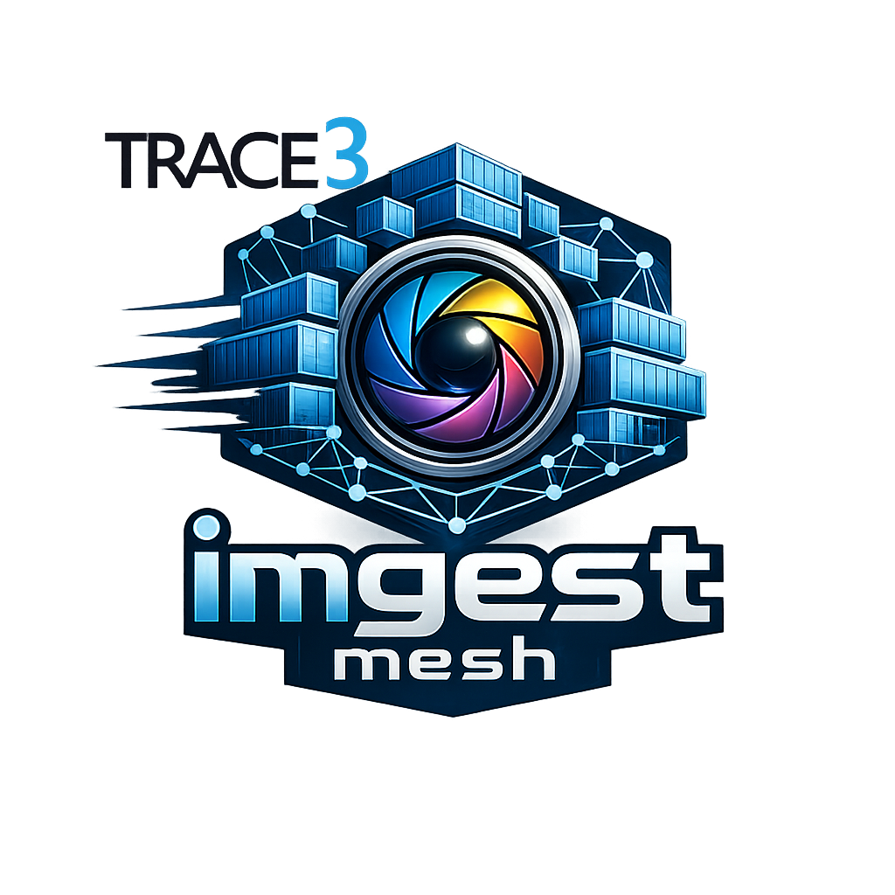

# Imgest-Mesh

## Trace3 Image Ingestion & Inspection Accelerator



## Overview

**Imgest-Mesh** is a containerized accelerator developed by **Trace3**
for deploying scalable **machine-vision inference pipelines** in modern
manufacturing environments.

The platform enables organizations to ingest high-volume camera data,
run AI models for automated inspection, and generate real-time pass/fail
decisions for production workflows. The system is designed for
**Industry 4.0 environments**, where high-speed image processing and
operational integration are critical for quality control and
manufacturing analytics.

Imgest-Mesh provides a modular architecture built on **containerized
microservices** designed to run on **Kubernetes or OpenShift**. This
allows the system to scale horizontally across GPU-enabled compute
infrastructure while remaining portable across on-premises, hybrid, or
cloud environments.

The accelerator is derived from real-world industrial AI deployments and
generalized into a reusable framework suitable for a wide range of
inspection and manufacturing use cases.

------------------------------------------------------------------------

## Reference Deployment Platform

The **Imgest-Mesh accelerator** is designed to run on modern GPU-enabled AI infrastructure platforms.
The initial reference environment for development and testing is the **Cisco AI Pod**, deployed with **Red Hat OpenShift**.

The Cisco AI Pod provides an enterprise-ready AI infrastructure platform that integrates:

- GPU-accelerated compute nodes
- High-performance storage
- High-bandwidth networking
- Kubernetes orchestration via **Red Hat OpenShift**

OpenShift provides a hardened enterprise Kubernetes distribution with additional capabilities including:

- Integrated container registry
- Secure workload isolation
- Role-based access control
- Enterprise networking and service routing
- DevOps and CI/CD integration

Because OpenShift is Kubernetes-compatible, the Imgest-Mesh architecture remains portable across environments while benefiting from OpenShift’s enterprise operational features.

### Target Platform Stack

The initial accelerator environment is built around the following stack:

```
Camera / Image Source
│
▼
Image Ingestion Service
│
▼
Pre-Processing Container
│
▼
Model Inference Container
│
▼
Pass / Fail Decision Engine
│
▼
Results & Integration Layer
```

This architecture allows the accelerator to leverage GPU resources for high-throughput image inference while maintaining enterprise-grade orchestration and security.

### Platform Portability

Although the reference deployment is **Cisco AI Pod + OpenShift**, the architecture is intentionally portable and may also run on:

- Standard Kubernetes clusters
- NVIDIA GPU infrastructure platforms
- On-prem HPC environments
- Hybrid or cloud-hosted GPU clusters

The accelerator containers follow **OCI standards** to ensure portability across container runtimes and orchestration platforms.

------------------------------------------------------------------------

## Accelerator Concept

Imgest-Mesh implements a **modular AI inspection pipeline** designed for manufacturing environments where high-volume camera data must be evaluated in real time.

The accelerator focuses on a common Industry 4.0 problem:

> **Continuously capture images from production systems and automatically determine whether each item passes or fails inspection.**

Rather than building a monolithic system, Imgest-Mesh breaks this workflow into **independent containerized services** that form a scalable processing pipeline.

### Conceptual Pipeline

At a high level, the system operates as follows:

```
Industrial Camera Systems
│
▼
Image Ingestion Service
│
▼
Image Preprocessing
│
▼
GPU Model Inference
│
▼
Pass / Fail Classification
│
▼
Manufacturing System Integration
```

### Pipeline Stages

**1. Image Capture**

Industrial camera systems capture images of products or materials during the manufacturing process. These images are streamed or delivered into the pipeline.

**2. Image Ingestion**

The ingestion service receives incoming images from edge systems, file drops, or message streams and prepares them for processing.

**3. Image Preprocessing**

Preprocessing containers normalize images for inference. Typical operations may include:

- cropping or region-of-interest selection
- resizing and normalization
- metadata extraction

**4. AI Model Inference**

GPU-accelerated inference containers run trained machine learning models that evaluate the image and detect potential defects or quality issues.

The output is a structured classification result.

**5. Pass / Fail Decision**

The decision layer converts model outputs into actionable classifications such as:

- Pass
- Fail
- Defect category (future expansion)

**6. Manufacturing System Integration**

Results are returned to downstream systems such as:

- Manufacturing Execution Systems (MES)
- Quality control dashboards
- alerting systems
- operational analytics platforms

This allows production workflows to respond immediately to detected defects.

### Why the Accelerator Approach

Many manufacturers attempt to build inspection pipelines from scratch. Imgest-Mesh accelerates this process by providing:

- a **ready-to-deploy containerized pipeline**
- **GPU-optimized inference services**
- **Kubernetes / OpenShift orchestration compatibility**
- a **modular architecture** that can adapt to different inspection models and camera systems

The goal is to reduce the time required to deploy production-grade AI inspection systems while maintaining flexibility for different manufacturing environments.


------------------------------------------------------------------------

## Key Capabilities

### Image Ingestion Pipeline

High-throughput ingestion of camera images or frame streams from
manufacturing systems.

Supported sources may include:

-   Industrial machine vision cameras
-   File drop systems
-   Edge gateway devices
-   Message queue or streaming platforms

The ingestion layer prepares image data for downstream AI processing.

------------------------------------------------------------------------

### AI Inference Layer

Containerized inference services run trained machine-learning or
deep-learning models that evaluate images and return **inspection
classifications** such as:

-   Pass
-   Fail
-   Defect categories (optional future expansion)

Models are designed to run efficiently on **GPU-accelerated
infrastructure** and can scale across nodes within a Kubernetes cluster.

------------------------------------------------------------------------

### Decision and Output Layer

Inference results are returned to downstream systems for:

-   Quality control decisions
-   Manufacturing dashboards
-   Alerting and operational monitoring
-   Integration with MES / factory systems

Results can be emitted via APIs, event streams, or storage systems
depending on deployment architecture.

------------------------------------------------------------------------

## Architecture

Imgest-Mesh follows a **microservice pipeline model** deployed on
Kubernetes:


Each stage of the pipeline is implemented as an independent container,
allowing the system to scale horizontally and evolve without disrupting
other components.

------------------------------------------------------------------------

## Platform Design Goals

The accelerator is designed with several key principles:

-   **Container Native**\
    All components are packaged as OCI containers.

-   **Kubernetes First**\
    Optimized for Kubernetes and OpenShift deployment.

-   **GPU Ready**\
    Supports GPU-accelerated inference workloads.

-   **Modular Architecture**\
    Each stage of the pipeline can evolve independently.

-   **Manufacturing Integration**\
    Designed to integrate with factory systems and operational
    dashboards.

------------------------------------------------------------------------

## Example Deployment Environments

Imgest-Mesh can run in several infrastructure configurations:

-   On-premises GPU clusters
-   Edge inference systems near production lines
-   Hybrid manufacturing cloud environments
-   High-performance computing clusters supporting AI workloads

------------------------------------------------------------------------

## Accelerator Components (Initial)

The project currently includes containerized services for:

-   Image ingestion
-   Image preprocessing
-   Model inference
-   Result classification
-   Pipeline orchestration

Additional services may include monitoring, logging, and integration
adapters.

------------------------------------------------------------------------

## Intended Use Cases

Typical applications include:

-   Automated visual inspection
-   Manufacturing defect detection
-   Quality assurance automation
-   Production analytics
-   High-volume camera inspection pipelines

------------------------------------------------------------------------

## Repository Structure (Initial)

```
.
├── containers/
│   ├── ingest/
│   ├── preprocess/
│   ├── inference/
│   └── decision/
│
├── k8s/
│   ├── deployments/
│   ├── services/
│   └── pipelines/
│
├── src/
│   └── model/
│
├── docs/
│   └── assets/
│       └── images/
│           └── t3-imgest-mesh.png
│
└── README.md
```

------------------------------------------------------------------------

## Status

This repository represents the **initial baseline of the Imgest-Mesh
accelerator**.

Documentation, deployment manifests, and container implementations will
continue to evolve as the accelerator matures.

------------------------------------------------------------------------

## Trace3

Trace3 provides advanced consulting and engineering services across AI,
data platforms, infrastructure, and modern application architectures.

This accelerator is part of Trace3's broader initiative to deliver
**AI-enabled operational platforms for Industry 4.0 environments**.
