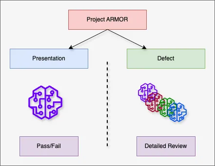

### Background                                                                  
                                                                                
The Automatic Lens Inspection (ALI) system is a critical component of Johnson & 
Johnson Vistakon's contact lens manufacturing process, ensuring consistent         
quality across 100 production lines operating 24/7. **Project ARMOR** is        
designed to evaluate and enhance the performance of advanced algorithms for        
defect detection, addressing challenges posed by both easily inspectable and       
difficult-to-inspect defect types using the current image formation setup.         
                                                                                
This project is divided into two complementary phases:                          
                                                                                
                                   
                                                                                
#### **Lens Presentation (Binary Classifier)**                                  
This phase focuses on developing a **binary classifier** to determine whether a 
contact lens passes or fails quality standards based on overall presentation.   
This classifier ensures lenses meet baseline quality requirements before        
advancing further in the production pipeline.                                   
                                                                                
#### **Lens Defects (Expanded Multi-Model Framework)**                          
The second phase involves developing multiple models capable of systematically  
detecting and classifying specific defect types based on standardized criteria. 
These defects include:                                                          
                                                                                
- **Edge Chips**: Damage or irregularities along the lens edge.                 
- **Bubble Scatter**: Air bubbles embedded within the lens material.            
- **Center Debris**: Particles or inconsistencies near the lens center.         
- **Lens Out-of-Round**: Irregular lens shapes affecting fit and function.         
                                                                                
By addressing both high-level quality control and detailed defect               
identification, Project ARMOR ensures a comprehensive inspection solution. 