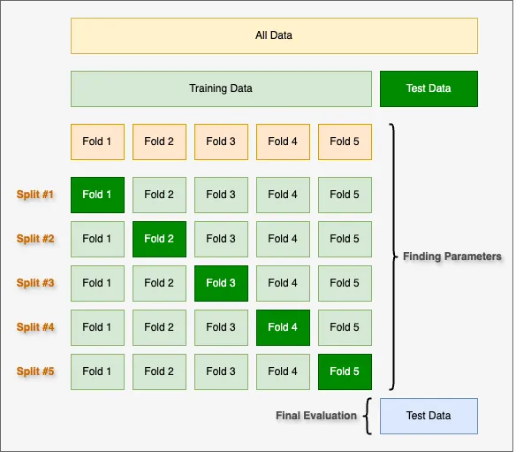

# Review of Process

## Evaluation Techniques

### K-Fold Cross-Validation
K-fold cross-validation is the primary method for evaluating model performance. It divides the dataset into `k` subsets (folds), where:

- The model is trained on `k-1` folds.

- The remaining fold is used for validation.

- The process is repeated `k` times, ensuring each fold serves as validation once.

**Benefits**:

- Reduces overfitting by testing on multiple validation sets.

- Provides robust performance metrics for both **Presentation** and **Defect-Specific Models**.

**Application to Project ARMOR**:

- Evaluate the Presentation Model for binary classification (pass/fail) performance.

- Assess Defect-Specific Models to ensure accuracy across defect categories, particularly for imbalanced data.

---

### Leave-One-Out Cross-Validation (LOOCV)
LOOCV is a special case of K-fold cross-validation where `k` equals the number of observations. Each data point is used as a validation set while the remaining data serves as the training set.

**Benefits**:

- Maximizes the use of training data for each iteration.

- Provides an unbiased estimate of model performance.

**Application to Project ARMOR**:

- Suitable for small or critical subsets of data, such as rare defect classes.

- Computationally expensive for large datasets and less practical for the full BMP repository.

---

### Validation Set Approach
The dataset is split into:

- **Training Set**: Used to train the model.

- **Validation Set**: Used to evaluate the model's performance.

**Benefits**:

- Simple and computationally efficient.

- Useful for quick assessments during model prototyping.

**Limitations**:

- May introduce bias if the dataset is not large enough.

- Not ideal for ARMOR due to potential underfitting or overfitting.

---

### Bootstrapping
Bootstrapping involves sampling the data with replacement to create multiple training datasets. The model is trained on these sampled datasets, and performance is evaluated on the remaining data.

**Benefits**:

- Provides a measure of performance uncertainty.

- Helps assess model robustness and generalization.

**Application to Project ARMOR**:

- Use to complement K-fold cross-validation, especially for evaluating defect detection on rare defect classes.

---

## Evaluation Metrics

To comprehensively assess the models, the following metrics will be used:

- **Accuracy**: Measures the overall correctness of the Presentation Model.

- **Precision**: Evaluates the proportion of true positives among predicted
  positives, critical for defect classification.

- **Recall**: Measures the proportion of true positives among actual positives,
  ensuring defects are not missed.

- **F1 Score**: Balances precision and recall, providing a single performance measure.

- **ROC Curve and AUC**: Visualizes the trade-off between true positive and
  false positive rates, particularly for the binary classification in the
Presentation Model.

---

## Workflow for Evaluation

1. **Initial Model Testing**:
       - Use a **validation set approach** to compare initial architectures for both
         the Presentation Model and Defect-Specific Models.

2. **Hyperparameter Tuning**:
       - Apply **K-fold cross-validation** (e.g., `k=5`) to fine-tune the models and
         optimize hyperparameters.

3. **Final Model Validation**:
       - Train the final models on the complete dataset.

       - Use **bootstrapping** or an additional holdout test set to assess
         generalization.

4. **Performance Comparison**:
       - Evaluate models using metrics like accuracy, precision, recall, and F1
         score.

       - Validate on edge cases like low-contrast images or overlapping defects.

