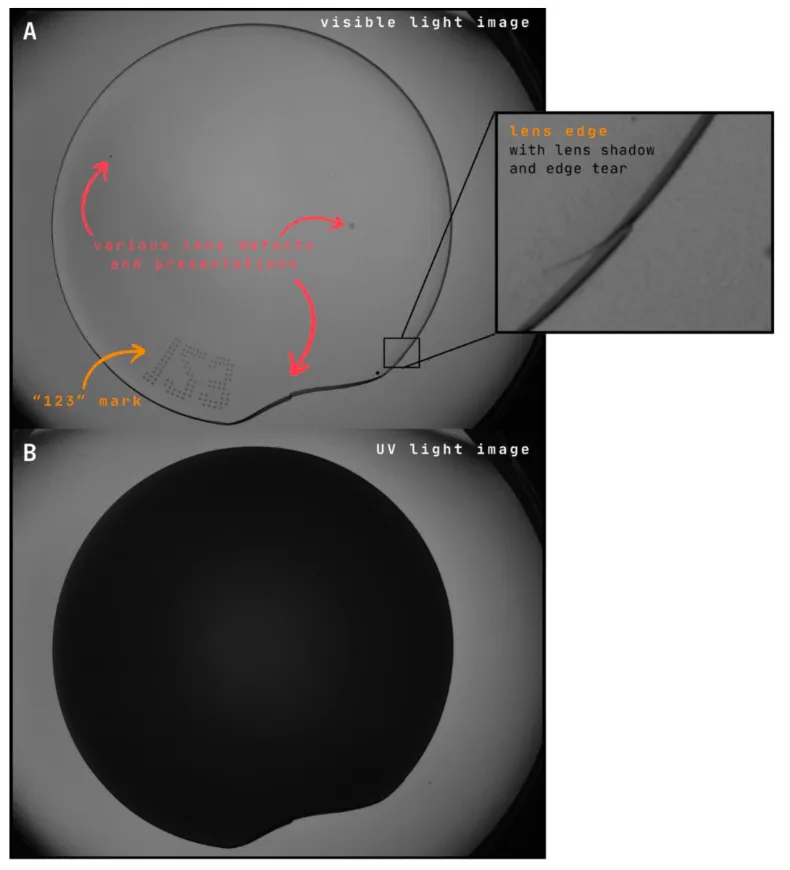
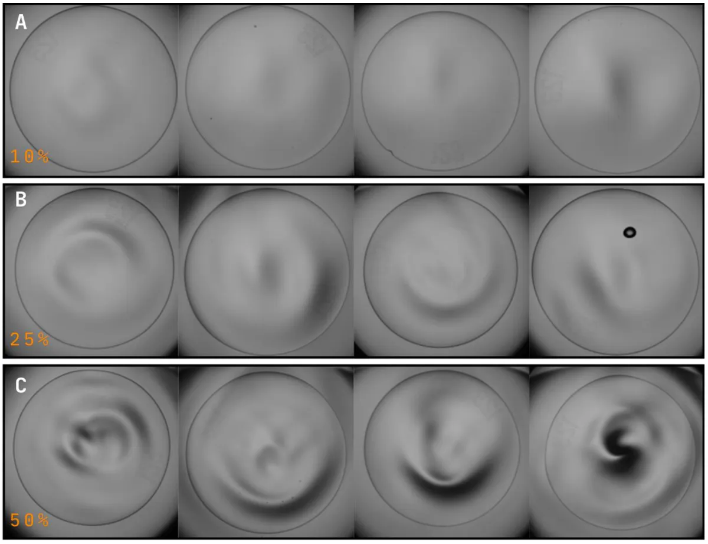

# Business Understanding for Project ARMOR

## Overview
The Automatic Lens Inspection (ALI) system is integral to Johnson & Johnson's
contact lens manufacturing process, operating across 100 production lines 24/7
to ensure high-quality products. Project ARMOR focuses on evaluating advanced
algorithms to enhance defect detection, especially for challenging
"non-inspectable" defects, using the current image formation setup. The ultimate
goal is to improve inspection accuracy and efficiency, while ensuring findings
are transferable to future imaging solutions.

## Objectives
The key objectives of this project are:

- **Enhance Defect Detection**: Develop and evaluate algorithms capable of identifying both inspectable and non-inspectable defects with high accuracy.

- **Improve Manufacturing Throughput**: Ensure the algorithms align with production cycle time requirements.

- **Transferable Learnings**: Identify insights and algorithm capabilities that can be leveraged with future imaging solutions.

- **Focus on Specific Defects**: Address defects that current systems fail to detect due to low contrast, such as:

      - Center debris

      - Lens out-of-round

      - Bubble scatter

      - Edge chips and tears

## Out of Scope
The following elements are excluded from the scope of this evaluation:

- **New Image Formation Solutions**: The project relies on the existing ALI imaging system for evaluations.

- **Integration**: Manufacturing integration, data management, and operator interface considerations are beyond the current scope.

- **Support Infrastructure**: Development of hardware or support systems for the evaluated algorithms.

## Success Criteria
To measure success, the project defines the following criteria:

- Achieve accurate classification for a broad range of defect types under production conditions.

- Ensure the algorithms meet throughput requirements, maintaining compatibility with the current ALI system.

- Deliver insights into defect classification challenges, including defect types that are difficult to detect and why.

## Manufacturing Locations
The project spans Johnson & Johnson MedTech facilities in:

- Jacksonville, Florida

- Limerick, Ireland

## References
The evaluation will adhere to internal standards and procedures, including:

- **QP-0075**: Visual Attribute Inspection Procedure

- **VWA-0974**: Lens Visual Inspection Work Aid

- **SGOP-0023**: Design, Procurement, and Maintenance of Equipment and Process Equipment

## Conclusion
Project ARMOR aims to significantly improve contact lens defect detection capabilities, leveraging advanced algorithms to bridge the gap between manual and automated inspection systems. By focusing on critical defect types and ensuring transferability of learnings, this initiative sets the stage for future innovation in lens inspection technology.
