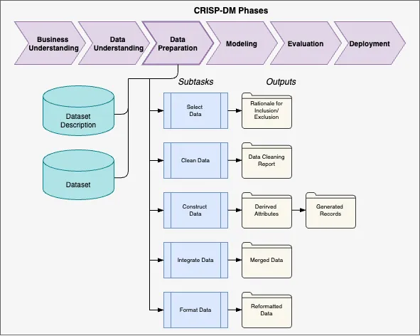

# Data Preparation

???+ warning "Select Data"
    | Output | | Owner | Status |
    |---|---|---|:---:|
    | Rationale for Inclusion/Exclusion| | D. Sayles |:material-circle-outline: |

???+ warning "Clean Data"
    | Output | | Owner | Status |
    |---|---|---|:---:|
    | Data Cleaning Report | | D. Sayles |:material-circle-outline: |

???+ warning "Construct Data"
    | Output | | Owner | Status |
    |---|---|---|:---:|
    | Derirved Attributes | | D. Sayles |:material-circle-outline: |
    | Generated Records| | D. Sayles |:material-circle-outline: |

???+ warning "Integrate Data"
    | Output | | Owner | Status |
    |---|---|---|:---:|
    | Merged Data | | D. Sayles |:material-circle-outline: |

???+ warning "Format Data"
    | Output | | Owner | Status |
    |---|---|---|:---:|
    | Reformated Data | | D. Sayles |:material-circle-outline: |

