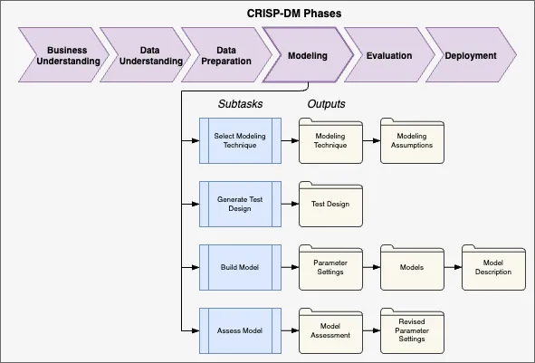

# Modeling

???+ warning "Select Modeling Technique"
    | Output | | Owner | Status |
    |---|---|---|:---:|
    | [Modeling Technique](../armor/model-frameworks-algos.md) | | D. Sayles |:material-timer-sand: |
    | Modeling Assumptions| | D. Sayles |:material-circle-outline: |

???+ warning "Generate Test Design"
    | Output | | Owner | Status |
    |---|---|---|:---:|
    | Test Design | | D. Sayles |:material-circle-outline: |

???+ warning "Build Model"
    | Output | | Owner | Status |
    |---|---|---|:---:|
    | Parameter Settings| | D. Sayles |:material-circle-outline: |
    | Models | | D. Sayles |:material-circle-outline: |
    | Model Description | | D. Sayles |:material-circle-outline: |

???+ warning "Assess Model"
    | Output | | Owner | Status |
    |---|---|---|:---:|
    | Model Assessment  | | D. Sayles |:material-circle-outline: |
    | Revised Parameter Settings | | D. Sayles |:material-circle-outline: |

