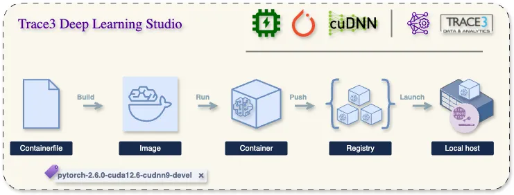

# Deep Learning Project Template (with Encrypted Host Data)

This repository serves as a **template** for deep learning projects. It provides:

- GPU-enabled containerized environment using Docker
- Read/write access to an **encrypted host directory** via LUKS
- Clean startup/teardown workflow using `Makefile` and scripts
- Optional keyfile-based unlocking for automation
- Clear structure intended to be forked for each new DL project



---

## Project Folder Structure

```
├── assets/               # Static assets, images, diagrams
├── config/               # Configuration files and environment variables
│   └── project.env       # Contains variables like KEYFILE_PATH
├── data/                 # Host-mounted data directory (encrypted at rest)
├── detectron2/           # Detectron2 repo (auto-cloned if missing)
├── docs/                 # Project documentation
├── resources/            # Docker container specs and build files
│   ├── Containerfile.dev
│   ├── Containerfile.prod
├── scripts/              # Host setup and container utility scripts
│   ├── setup-host.sh               # Mount and decrypt host volume (auto-creates if missing)
│   ├── unmount-host.sh             # Safe unmount + close encrypted volume (daily)
│   ├── destroy-encrypted-volume.sh # Full project teardown (key + image)
│   └── generate-keyfile.sh         # Secure keyfile generator
├── src/                  # Source code for your DL project
├── .gitignore
├── Makefile
└── README.md             # You're reading it
```

---

## One-Time Setup (Per Project Fork)

1. Clone or fork this template repository.
2. Create an encrypted volume image (if one doesn't exist):
   ```bash
   sudo fallocate -l 100G encrypted_volume.img
   sudo cryptsetup luksFormat encrypted_volume.img
   ```
3. Generate and register a secure keyfile:
   ```bash
   make init-keyfile
   sudo cryptsetup luksAddKey encrypted_volume.img /root/keyfile.bin
   ```
4. Mount the encrypted volume:
   ```bash
   make setup-host
   ```

---

## Daily Workflow

### Start of Session

```bash
make setup-host     # Mount encrypted volume at /mnt/encrypted_data
make run-dev        # Start dev container with mounted data and GPU access
```

### Optional: Open a Shell

```bash
make shell-dev      # Opens bash shell in the dev container
```

### End of Session

```bash
make teardown-host  # Unmount and close encrypted volume
```

---

## Makefile Commands

- `make build-dev` — Build the development container
- `make build-prod` — Build the production container (includes baked code)
- `make run-dev` — Run dev container (with mounted code/data)
- `make run-prod` — Run prod container (with mounted data only)
- `make shell-dev` — Open a dev container shell
- `make setup-host` — Mount and open encrypted volume
- `make teardown-host` — Unmount and close encrypted volume
- `make init-keyfile` — Generate a secure keyfile and store it (path in config)
- `make clean` — Remove both dev and prod images

---

## Configurable Variables

This project uses environment variables loaded from `config/project.env`.

To get started:

```bash
cp config/project.env.example config/project.env
```

Then open config/project.env and set your keyfile path:
```bash
KEYFILE_PATH=/root/keyfile.bin
```

> This file is read by setup-host.sh, generate-keyfile.sh, and the Makefile. It is not committed to Git for security reasons.

---

## Notes

- Do **not** commit the keyfile or encrypted volume to Git.
- The `detectron2` repo is cloned automatically if missing.
- All data stored in `data/` is decrypted only while mounted.
- Always run `make teardown-host` before shutting down your session or host machine.

---

## Forking Guidelines

1. Fork this repo for each deep learning project.
2. Give each project its own encrypted volume and optionally a separate keyfile.
3. Update `project.env` and `Makefile` image tag accordingly.
4. Use the same commands across projects for consistent, secure workflows.

---

## Future Improvements

- Add support for S3-based encrypted backups
- Hook into GitHub Actions or CI/CD for model training jobs
- Optional CryFS or FUSE-based mounting as an alternative to LUKS

---

## Getting Started on a New System

This section outlines the setup process to prepare a new host machine for use with this project.

### 1. Clone the Project

```bash
git clone https://gitlab.com/dosayles/t3-deeplearning.git
cd t3-deeplearning
cp config/project.env.example config/project.env
```

Edit `config/project.env` to match your environment. At a minimum, set:

```bash
KEYFILE_PATH=/root/keyfile.bin
```

---

### 2. Install Required Tools

Make sure the following are installed on your system:

- Docker (with GPU runtime)
- cryptsetup (LUKS)
- git, wget, curl
- make

Install essentials on Ubuntu:

```bash
sudo apt update
sudo apt install cryptsetup git make curl wget -y
```

---

### 3. Initialize the Project

This will:
- Generate a secure keyfile (if not already present)
- Create and format `encrypted_volume.img` (if it doesn't exist)
- Mount it to `./data`

```bash
make init
```

---

### 4. Start Development

Start the container with GPU support:

```bash
make run-dev
```

Or open an interactive shell inside the container:

```bash
make shell-dev
```

---

### 5. End of Session

Unmount and secure the encrypted volume:

```bash
make unmount-host
```

---

### Notes

- `encrypted_volume.img` should be stored persistently and backed up if valuable.
- The keyfile location is controlled via `config/project.env`.
- Never push the keyfile or encrypted volume to Git.
- `detectron2/` is auto-cloned if missing during build.


