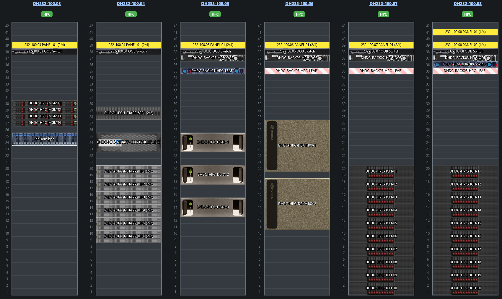

# Cluster Hardware Overview

!!! abstract "Cluster overview"

    This guide is tailored for operators and administrators of the cluster,
    detailing such items as the _As Built_ approach and basic level useability
    aspects.

## Rack Elevation

{ width=100% }
*Elevation diagram, provided from client...*

## Worker Node Compute Infrastructure

## Worker Node Network Overview

## Storage Architecture

## Data Science Workflow

## Domains

