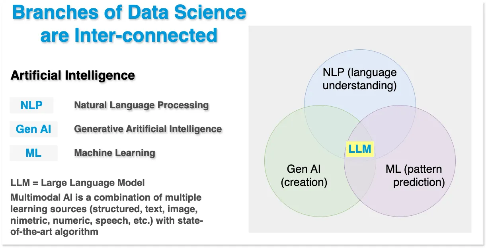

---
tags:
  - data science
  - welcome
  - smart factory
---

# Trace3 Imgest-Mesh:

## Purpose Built Data Science for Smart Factory

{ width="45%" }

At Trace3, the Data Science team operates within the Data & Analytics Business
Unit, providing innovative solutions that bridge the gap between raw data and
actionable insights. Our team excels in leveraging a diverse toolkit of advanced
technologies and methodologies to tackle the most complex data challenges across
industries.

We recognize that the branches of data science—Natural Language
Processing (NLP), Generative Artificial Intelligence (Gen AI), and Machine
Learning (ML)—are interconnected and work synergistically to drive innovation.
Our approach is rooted in leveraging these disciplines to tackle complex
challenges, transform data into actionable insights, and deliver cutting-edge
solutions tailored to our clients' needs.

- **NLP (Language Understanding)**: We harness NLP techniques to analyze and
  interpret human language, enabling advanced solutions in areas such as
sentiment analysis, chatbots, and text summarization.
- **Gen AI (Creation)**: Generative AI powers creative solutions, from text
  generation to multimodal applications that integrate structured, image,
numeric, and speech data.
- **ML (Pattern Prediction)**: Machine learning is at the heart of predictive
  analytics, empowering organizations to anticipate trends, optimize processes,
and drive better decision-making.

With Large Language Models (LLMs) at the intersection of these branches, we
unlock the full potential of multimodal AI by combining diverse data sources
with state-of-the-art algorithms. This integrated approach ensures we deliver
comprehensive, forward-looking solutions that address real-world business
challenges.

## Statistical Learning and Operations Research

Additionally, we view Statistical Analytics and Operations Research (OR) as the
analytical backbone of intelligent decision-making, transforming uncertainty
into structure and complexity into clarity. Grounded in the principles of
statistical learning, inference, and optimization, these disciplines provide the
mathematical and computational foundation for understanding variability,
quantifying risk, and identifying the levers that most strongly influence
outcomes. Through rigorous modeling, simulation, and experimentation, we move
beyond descriptive reporting to prescriptive insight—enabling organizations to
not only understand what has happened, but to determine what should happen next.

Statistical learning equips us to extract signal from noise, build robust
predictive models, and validate hypotheses with confidence, while Operations
Research applies these insights to the design of optimal systems—balancing cost,
performance, reliability, and resilience across complex, interconnected
processes. From stochastic modeling and forecasting to optimization, queuing
theory, and decision analysis, the fusion of statistics and OR allows us to
engineer data-driven strategies that scale, adapt, and perform under real-world
constraints. Together, these disciplines form the intellectual engine of this
project, driving a systematic, quantitative approach to solving high-impact
business and operational challenges.

## Progenitor Documents

???- abstract "Proposed Project Overview"
    [Download PDF](assets/files/das-LM-ROI-v2.pdf)

    {type=application/pdf style="min-height:60vh;width:100%"}

???- abstract "Operations Research Proposal"
    [Download PDF](assets/files/das-proposal.pdf)

    {type=application/pdf style="min-height:100vh;width:100%"}

At Trace3, the Data Science team is more than a collection of experts; we are
innovators and problem-solvers dedicated to unlocking the full potential of data
to drive success for our clients.
