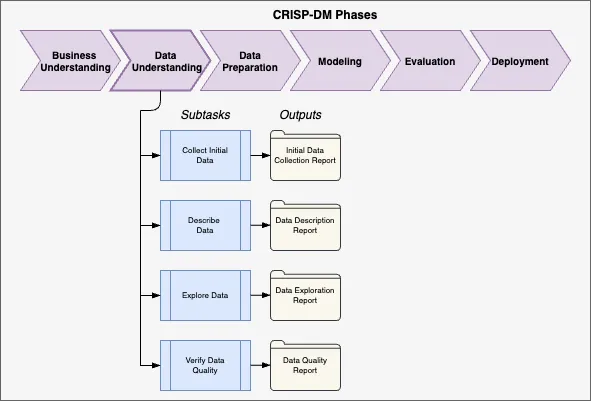

# Data Understanding

## Data Sources
The data for Project ARMOR comes from high-resolution imaging of contact lenses during automated manufacturing inspection.
Two imaging modalities are captured for each lens:

1. **Visible Light Images (Primary Modality)**
    - 2048×4096 resolution BMP images.
    - Used for detecting most lens surface and edge defects.
    - Provides contrast necessary to classify bubbles, debris, tears, chips, and other anomalies.

2. **Ultraviolet (UV) Images (Secondary Modality)**
    - Paired with visible light captures (dual-modality).
    - Appears darker overall.
    - Used primarily for **hole verification** and **lens positioning**.
    - Defects such as center holes appear bright under UV illumination.

Data originates from production lines in **Jacksonville, Florida** and **Limerick, Ireland**, covering thousands of unique SKUs.

---

## Image Characteristics
- Each image includes a **contact lens suspended in DI water** within its primary package.
- Defects vary widely in size and morphology, from sub-5 pixel anomalies to large-scale edge deformities.
- Primary Package Marks (PPMs) are batch-specific artifacts that may resemble bubbles or tears but repeat consistently across all images from a batch.
- Lens orientation is determined via the **“123” mark** — mirrored orientation is correct, non-mirrored indicates inversion.

---

## Annotation Structure
Annotations follow a structured, phased workflow defined in the ARMOR Annotation Guide:

1. **Primary Package Marks (PPM Phase)**
    - Annotators identify and track permanent packaging marks.
    - PPMs must be distinguished from true defects to avoid false positives.

2. **Major Defects / Tags Phase**
    - Gross classifications such as “Lens Folded,” “Ripple,” “Extra Lens,” or “Missing Lens.”
    - Exclusive tags are applied when a gross presentation failure makes further annotation unnecessary.

3. **Center and Edge Defects (CED Phase)**
    - Fine-grained defect annotation, including:
        - **Center defects**: debris, holes, surface tears.
        - **Edge defects**: chips, tears, exterior excess, bottle-capping.
        - **Bubble classifications**: low-contrast, clusters, edge-contact, scatter.
    - Annotators use polygons, bounding boxes, or ellipses, with attributes (size, arc length, transparency, etc.).

4. **Validation Stage**
    - Annotations are reviewed against ground truth datasets.
    - Jobs are accepted or returned to annotators for correction.

---

## Defect Classes
Defects are defined by both **presentation anomalies** and **true defects**:

- **Presentation Anomalies (Lens State)**:
    - Out-of-focus edge
    - Out-of-round shape (roundness > 1.1)
    - Bottle-capped edge (>5% arc length undulation)
    - Folded lens
    - Missing lens
    - Multiple lenses
    - Lens inverted (123 mark not mirrored)
    - Ripple obstruction (≥50% area impacted)
    - Bubble obstruction (>4% area impacted)
    - Edge obstruction/off-image (>4% arc length)

- **True Defects (Lens Material Issues)**:
    - Center debris (>5 pixels longest dimension → Fail).
    - Center hole (>5 pixels diameter → Fail).
    - Center surface tear (>5 pixels length → Fail).
    - Edge chip (>5 pixels radial depth → Fail).
    - Edge not closed (always Fail).
    - Edge tear (>5 pixels length → Fail).
    - Edge exterior excess (>5 pixels radial length → Fail).

---

## Data Volume & Distribution
- **Scale**: Target dataset exceeds **50,000 images** across multiple SKUs and batches.
- **Batch Effects**: PPMs introduce structured noise that must be annotated consistently per batch.
- **Class Imbalance**: Certain defect types (e.g., bubbles, debris) appear frequently, while rare defects (e.g., missing lens, folded lens) may have few examples.
- **Multi-Label Nature**: A single image may contain multiple defects and attributes simultaneously (e.g., a bubble cluster overlapping the 123 mark).

---

## Data Quality Considerations
1. **Annotation Consistency**
    - Annotator drift and fatigue can cause label variability.
    - Quality control involves multi-stage validation and comparison to ground truth.

2. **Low Contrast Conditions**
    - Defects like bubbles and debris may blend into background, creating uncertainty.
    - A dedicated *Unknown-Low-Contrast* label captures ambiguous cases.

3. **Size Thresholds**
    - Sub-5 pixel anomalies are recorded for trending but not considered failures.
    - Ensures focus on production-critical defects.

4. **False Positives**
    - PPMs, shadows, and diffraction artifacts risk misclassification as defects.
    - UV modality provides an additional check (e.g., holes appear bright, bubbles do not).

5. **Operational Challenges**
    - Data volume requires optimization of preprocessing (RAM prefetching, parallel pipelines).
    - Maintaining balance across defect classes is necessary to avoid bias.

---

## Key Insights
- Data complexity is driven by **dual-modality imaging**, **multi-label defect space**, and **batch-specific artifacts**.
- Annotation guidelines are rigorous, but human error introduces variability that must be accounted for in training.
- Regulatory thresholds demand extremely high precision/recall for certain defects (≥99% TAR for folded/missing lenses).
- Understanding the data at this granular level ensures the modeling phase addresses both *algorithmic accuracy* and *business-critical defect coverage*.

???- success "Data Understanding - Team Notes"
    [Download PDF](/armor/JNJEDA.pdf)

    {type=application/pdf style="min-height:69vh;width:100%"}

---

## Alignment with CRISP-DM
The Data Understanding phase builds on **Business Understanding** by:
- Characterizing the types of data (visible + UV images, annotations).
- Identifying challenges such as annotation consistency, defect overlap, and low contrast conditions.
- Establishing the mapping between defect classes and business-critical inspection requirements.

This foundation informs **Data Preparation**, ensuring preprocessing pipelines address both technical constraints and regulatory defect definitions.
