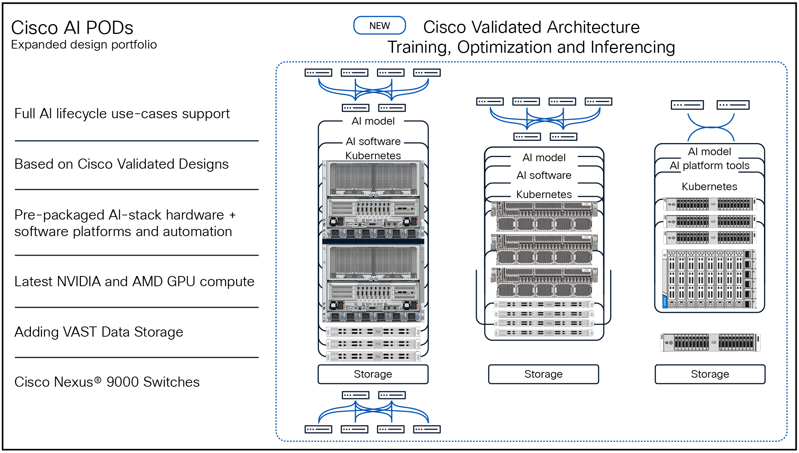

{ width="320" }

# Imgest-Mesh on Cisco AI Pods — Solution Whitepaper

> **Audience:** AI engineers, ML platform leads, and infrastructure architects evaluating the Imgest-Mesh accelerator on a Cisco AI Pod for the JNJ-Armor manufacturing-inspection use case.
>
> **Status:** Pre-demo design document, dated 2026-04-27. Several physical-stack specifics are flagged as *to confirm* — the build sheet from the Cisco AI Pod team is the source of truth for those.

---

## 1. Executive summary

Imgest-Mesh is a containerized machine-vision inference platform purpose-built for high-volume manufacturing inspection. The reference deployment, JNJ-Armor, replaces Johnson & Johnson MedTech's legacy Automatic Lens Inspection (ALI) system across approximately 100 contact-lens production lines. The upcoming Cisco AI Pod demo runs the Imgest-Mesh containers against JNJ-Armor's trained Detectron2 / YOLOX models on Cisco UCS X-Series compute paired with NVIDIA GPUs, deployed on Red Hat OpenShift.

The architecture's defining property is *operational simplicity through container boundaries*: each pipeline stage is one OCI image with a single FastAPI surface and a filesystem bind-mount as its wire protocol, so scaling, observability, and platform portability all behave identically from a developer laptop to the Cisco Pod. GPUs are required only for the inference stage; every other stage is CPU-only. This concentrates accelerator cost where it converts to throughput and leaves the rest of the platform commodity.

---

## 2. Use case and business context

**The line problem.** Each of J&J's lens lines runs at takt times around the 0.5–2 second range and produces frames continuously through high-resolution machine-vision cameras (GigE class). The legacy ALI system flags candidate defects but cannot reliably distinguish certain defect classes, requiring manual re-inspection that absorbs operator hours and rate-limits throughput. The replacement objective: end-to-end automated pass/fail with model-driven confidence per frame, surfaced to the Manufacturing Execution System (MES) inside the line takt window.

**Business outcomes the demo establishes.**
- Reduce manual inspection load on a per-line basis.
- Standardize the inspection pipeline across heterogeneous production lines.
- Move the deployment surface from bespoke per-line installs to a cloud-native (Kubernetes/OpenShift) platform that scales in proportion to line count, not per-line engineering effort.

**Demo framing.** Imgest-Mesh is the *generic implementation of the Armor project*; the JNJ-Armor sibling repo carries the customer-specific data, models, and notebooks. The demo runs the generic platform against the customer's actual model artifacts — not a synthetic stand-in.

{ width="100%" }

*High-level edge architecture — the per-line view. Each production line drives a Camera Connector → Image Orchestration → System Manager → Image Compressor stack, fed by PLC and OPC telemetry. The Cisco AI Pod consolidates many of these line-stacks behind a single OpenShift control plane.*

---

## 3. Solution architecture — application stack

The application is six independent containers orchestrated via Compose locally and via OpenShift manifests in production. The wire protocol between stages is the filesystem (bind-mounts in dev, PersistentVolumeClaims on OpenShift). On a real production line a message bus (Kafka / NATS) replaces the filesystem for fan-out, but the service shapes don't change.

{ width="100%" }

*High-level system architecture — Imgest-Mesh's reference data flow from machine-vision sources through the inference plane to downstream IT/OT consumers (MES, historian, IoT broker).*

| Stage | Container | Role | GPU? | Container port |
|---|---|---|---|---|
| 1 | `camera` | Captures frames from GigE camera, writes raw frames | No | 8081 |
| 2 | `orchestrator` | Watches frames, routes to inference replicas | No | 8082 |
| 3 | `inference` | **Runs the model**, emits per-frame pass/fail + confidence + sidecar | **Yes** | 8083 |
| 4 | `webserver` | Operator dashboard (status, pipeline visualization) | No | 8080 |
| 5 | `docs` | Imgest-Mesh project documentation (MkDocs Material) | No | 8000 |
| 6 | `jnj-armor-docs` | Linked customer-engagement documentation, built from the JNJ-Armor sibling repo | No | 8001 |

**Service surface uniformity.** Stages 1–4 each expose a FastAPI with two endpoints: `/healthz` (liveness) and `/status` (structured operational counters — frames processed, last verdict, current state). The dashboard is a thin HTML+JS client that polls all three pipeline stages every 10 s. This same surface satisfies Kubernetes liveness/readiness probes and gives Prometheus / Grafana / a customer MES three identical integration points.

**Data flow.** Camera writes frames → orchestrator routes per-line → inference runs the model and writes a JSON sidecar plus (optionally) an annotated image → MES or downstream IT/OT system consumes the verdicts. In the JNJ-Armor target deployment a dedicated **Image Compressor** stage and a **System Manager** stage flank inference (per Doug Sayles' edge architecture); both are placeholders today and slot into the same FastAPI shape when implemented.

**Documentation as part of the deployment.** The docs and jnj-armor-docs containers are deliberately part of the application stack, not a separate publishing pipeline. On OpenShift each gets its own Deployment + Service + Route. This keeps the demo's "platform plus engagement, side by side" narrative reachable from any node on the customer's network without extra infrastructure.

{ width="100%" }

*Low-level edge architecture — component view of the inference plane. Cameras feed the Camera Connector and Image Orchestration components; multiple inference containers fan out behind the orchestrator; System Manager handles edge configuration and PLC/OPC ingest; the Image Compressor produces the compressed image plus JSON sidecar that egresses to downstream IT/OT systems.*

---

## 4. Models leveraged

The inference container loads model weights produced by the JNJ-Armor data-science track (R + Python, Detectron2 / YOLOX / Roboflow). The Imgest-Mesh runtime is model-agnostic — the swap point is `resources/inference/app/worker.py`. Today it runs in mock mode (random pass/fail at an 80 % pass rate, configurable via `pass_rate` in `worker.py`).

**Two model generations are in scope:**

- **Stage 1 — monolithic Detectron2 classifier.** ~43 MB weights file (`stg1_best.pt`). Trained on 1k images with the "goodtimesbadtimes" labeling convention. Used as the baseline pipeline-establishment model. Suitable for CPU fallback; on GPU it's effectively free in latency terms.
- **Stage 2 — Detectron2/YOLOX/Roboflow ensemble (in development).** Larger, multi-stage detection pipeline using a Roboflow-trained backbone. Inference is invoked through the Roboflow `inference-sdk` Python package or, for offline/air-gapped deployments, a downloaded `.pt` artifact. This is the model the Cisco demo targets.

**Model artifact contract.** JNJ-Armor produces and tags weight files; Imgest-Mesh's inference container loads whatever file is present at the configured mount point. The contract is one file (`.pt` or `.onnx`) and one config value (model identifier + threshold). Nothing else is shared between the two repos at runtime.

**Mock-to-real migration.** The transition is documented in `docs/dev/local-dev.md` § *Inference mode*. Five steps: env-switch `INFERENCE_MODE`, model-loader module, replace random verdict with real inference, retain mock for tests/air-gap, swap model by config change. The Cisco demo target is at step 3.

---

## 5. Physical stack — Cisco AI Pod + NVIDIA

{ width="600" }

*Cisco AI Pod — the validated UCS-X compute + NVIDIA accelerator + Red Hat OpenShift platform that hosts Imgest-Mesh in production.*

**Confirmed at the application/platform layer:**
- **Compute:** Cisco UCS X-Series chassis (X9508 class) with X210c / X410c M7 compute nodes. *To confirm: exact node count and SKU per pod.*
- **Accelerator:** NVIDIA datacenter GPUs (H100, H200, or L40S tier). *To confirm: GPU SKU and count per node, and whether any nodes are CPU-only.*
- **Networking:** Cisco Nexus / UCS-X fabric, expected 100/200/400 GbE backbone with RDMA-capable NICs for storage. *To confirm: actual VLAN and storage-network design.*
- **Storage:** PersistentVolume backend (NetApp ONTAP / VAST / Pure / NFS depending on pod tier). Frame data, model artifacts, and parquet historian writes all sit here. *To confirm: storage class, IOPS budget, snapshot policy.*
- **Platform:** Red Hat OpenShift on bare-metal UCS, with the NVIDIA GPU Operator and Node Feature Discovery installed.

**Why Cisco AI Pod for this workload.**
- Pre-validated UCS-X + NVIDIA GPU + OpenShift integration removes weeks of platform plumbing.
- Cisco's reference architectures cover the GPU Operator install and NVIDIA-driver layering by default — the ML team installs containers, not drivers.
- The X-Series chassis design lets the pod start at one GPU node and grow without re-cabling, which matches a 100-line rollout.
- Storage and networking are validated against the same reference architecture, so latency budgets are predictable.

---

## 6. GPU utilization — which container, where, and why

**Only the `inference` container needs a GPU.** Camera, orchestrator, webserver, docs, and jnj-armor-docs are deliberately CPU-only. This isolation is intentional and load-bearing: GPUs are consumed in proportion to *inference throughput requirements*, not per-line engineering. A single GPU node serves many inference replicas; many lines feed into them.

**Runtime requirements (inference container).**
- Base image with CUDA matching the trained model's PyTorch build (currently CUDA 12.x for Detectron2 + Roboflow stack).
- NVIDIA Container Toolkit on the worker node (provided by the GPU Operator on OpenShift).
- K8s resource request: `nvidia.com/gpu: 1` per pod, with `limits` matching to prevent oversubscription.
- Node selector / taint affinity so pods land on GPU-bearing UCS-X compute blades.

**Recommended replica/sharding model (initial deployment).**
- One inference replica per GPU as the starting topology.
- Many camera/orchestrator pods feed a smaller pool of inference pods through filesystem (PVC) channels — the orchestrator does the line-to-replica routing.
- For a 100-line target, expected aggregate inference QPS sits in the low-thousands range depending on takt time. A single H100 with TensorRT/INT8 should handle several hundred QPS on a Stage-2-class detection model — so a small handful of GPU pods covers the load with headroom. *Verify against Stage-2 model latency once the artifact is finalized.*

**Where GPUs are *not* used.**
- Frame I/O: bound by network and disk, not compute.
- Verdict serialization, logging, metric aggregation: trivially CPU-bound.
- Documentation containers: nginx serving static HTML — irrelevant to the GPU plane.

This is the property that makes the platform cost-efficient on a pod: GPU spend tracks the inference workload, not the platform footprint.

---

## 7. Optimization opportunities

1. **TensorRT compilation.** Convert the Stage-2 PyTorch model to TensorRT engine files at deployment time. Typical 2–4× latency reduction and a meaningful tail-latency improvement, which matters for line takt. Compatible with both Detectron2-derived and YOLOX exports.
2. **Mixed precision (FP16 / INT8).** Detection models tolerate FP16 with negligible accuracy loss and INT8 with calibration. INT8 on H100 / L40S unlocks the structured sparsity tensor cores. Validate per-class accuracy against J&J's QA bar before committing.
3. **Triton Inference Server.** If the Stage-2 ensemble grows to multiple models (different lens products, different defect taxonomies), front them with NVIDIA Triton. Gets dynamic batching, model versioning, and concurrent execution across one GPU "for free." Slot Triton in as the inference container's worker; the FastAPI surface stays.
4. **Multi-Instance GPU (MIG) on H100.** If individual model replicas don't saturate a full GPU, MIG partitions one H100 into up to 7 isolated slices. Each slice gets its own pod assignment. Useful when running both Stage-1 (small) and Stage-2 (large) models concurrently.
5. **Dynamic batching at the orchestrator.** The orchestrator can window incoming frames per N ms and submit them to inference as a batch. Detectron2 and YOLOX both benefit substantially from batching even at modest sizes.
6. **CUDA graph capture.** For the steady-state inference loop (fixed input shape, fixed model), capturing a CUDA graph reduces per-call kernel launch overhead. Free wins after Triton/TensorRT.
7. **Autoscaling.** OpenShift's HPA can scale inference replicas on a custom metric (input queue depth from `/status`, or NVIDIA DCGM GPU utilization). Up-scale aggressively at start-of-shift, scale down during line changeovers.

---

## 8. Open questions to confirm before the 2026-05-20 demo

- **GPU SKU and count per pod.** This determines whether MIG / Triton / TensorRT prioritization changes.
- **Storage class.** Frame I/O burst rate × line count must fit the backing storage's sustained bandwidth.
- **Browser-to-service routing.** The dashboard currently fetches `/status` from `localhost:808[1-3]`. On OpenShift this needs either a reverse-proxy through the webserver pod or per-service Routes — to be settled in the K8s manifests work (job-2).
- **Stage-2 model artifact format.** PyTorch `.pt` vs. ONNX vs. pre-built TensorRT engine. Affects the inference container's base image and warmup behavior.
- **Per-class accuracy tolerance for INT8.** Determines whether INT8 is on the demo path or a follow-on optimization.
- **Air-gap requirements.** Customer-site OpenShift may not have outbound internet; affects Roboflow SDK calling pattern and whether models must be baked into the image.

---

*This document is a pre-demo design statement. Specifics flagged "to confirm" are blocking inputs from the Cisco AI Pod team and the JNJ-Armor model team. Update this whitepaper as those inputs land — it is intended to be the canonical architecture reference for AI professionals onboarding to the deployment.*
