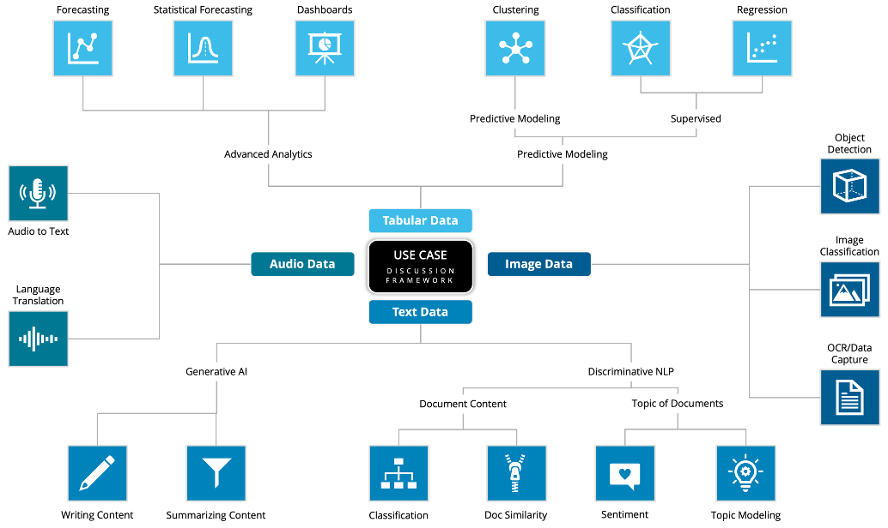

# Use Case Ideation Workshops

## Overview

A Use Case Ideation Workshop is a structured, collaborative session designed to
help stakeholders identify, refine, and prioritize high-value use cases for
advanced analytics, machine learning, and AI-driven initiatives. These workshops
are tailored to foster alignment across business and technical teams, ensuring a
shared vision and actionable outcomes.

Our workshops are typically **half-day sessions**, balancing structured guidance
with interactive brainstorming to ensure productive use of time while driving
meaningful insights and alignment.

---

## Objectives

1. **Identify High-Value Use Cases**  Guide stakeholders in uncovering potential
   opportunities that align with strategic business goals and challenges.

2. **Refine Ideas with a Feasibility Lens**  Evaluate and prioritize use cases
   based on feasibility, impact, and readiness using proven frameworks.

3. **Achieve Alignment Across Teams**  Ensure business, technical, and data
   science teams are aligned on priorities and objectives.

4. **Lay the Groundwork for Actionable Next Steps**  Provide a roadmap for
   implementation, including resource planning, technical requirements, and
measurable success criteria.

---

## Workshop Structure

### **1. Kickoff and Objective Setting** (30 minutes)
- Introductions and overview of the session agenda.
- Establish the goals and desired outcomes for the workshop.
- Share industry trends and examples of successful use cases for inspiration.

### **2. Understanding Challenges and Opportunities** (60 minutes)
- Discuss business pain points and unmet opportunities.
- Map these challenges to potential data-driven solutions using the **Use Case
  Discussion Framework** (as shown below).
- Encourage stakeholders to explore areas such as tabular, text, image, and
  audio data.



### **3. Use Case Brainstorming** (60 minutes)
- Interactive brainstorming session with stakeholders:
  - What processes or decisions could be improved with analytics or AI?
  - What key business questions remain unanswered today?
- Capture and categorize use cases into themes (e.g., predictive modeling,
  generative AI, NLP, etc.).

### **4. Feasibility and Impact Analysis** (30 minutes)
- Evaluate each use case using criteria such as:
  - **Business Value**: How impactful is the solution for the organization?
  - **Feasibility**: Do we have the data, tools, and expertise to achieve it?
- Prioritize use cases into actionable tiers (e.g., high-priority,
  medium-priority, low-priority).

### **5. Closing and Next Steps** (30 minutes)
- Summarize key takeaways and decisions from the workshop.
- Provide a proposed roadmap for implementation and pilot testing.
- Align on next steps for project initiation and stakeholder engagement.

---

## Outcomes

By the end of the workshop, participants will have:

- A **prioritized list of use cases** aligned with business goals.
- A **shared understanding of feasibility and impact** for each use case.
- A **roadmap** for next steps, including ownership, timelines, and
  deliverables.

``` vegalite
{
  "$schema": "https://vega.github.io/schema/vega-lite/v5.json",
  "description": "Separate bar charts for People, Process, and Technology, each with its own specific metrics on the x-axis.",
  "hconcat": [
    {
      "data": {
        "values": [
          {"category": "People", "metric": "Communication", "value": 80},
          {"category": "People", "metric": "Engagement", "value": 70},
          {"category": "People", "metric": "Skill Levels", "value": 65},
          {"category": "People", "metric": "Collaboration", "value": 75},
          {"category": "People", "metric": "Motivation", "value": 68},
          {"category": "People", "metric": "Feedback", "value": 78}
        ]
      },
      "mark": "bar",
      "encoding": {
        "x": {
          "field": "metric",
          "type": "nominal",
          "axis": {"title": "People Metrics", "labelAngle": -45}
        },
        "y": {
          "field": "value",
          "type": "quantitative",
          "axis": {"title": "Score"}
        },
        "color": {"field": "metric", "type": "nominal", "legend": null}
      }
    },
    {
      "data": {
        "values": [
          {"category": "Process", "metric": "Efficiency", "value": 75},
          {"category": "Process", "metric": "Standardization", "value": 60},
          {"category": "Process", "metric": "Compliance", "value": 85},
          {"category": "Process", "metric": "Automation", "value": 70},
          {"category": "Process", "metric": "Scalability", "value": 65},
          {"category": "Process", "metric": "Governance", "value": 77}
        ]
      },
      "mark": "bar",
      "encoding": {
        "x": {
          "field": "metric",
          "type": "nominal",
          "axis": {"title": "Process Metrics", "labelAngle": -45}
        },
        "y": {
          "field": "value",
          "type": "quantitative",
          "axis": {"title": "Score"}
        },
        "color": {"field": "metric", "type": "nominal", "legend": null}
      }
    },
    {
      "data": {
        "values": [
          {"category": "Technology", "metric": "Adoption", "value": 50},
          {"category": "Technology", "metric": "Reliability", "value": 90},
          {"category": "Technology", "metric": "Scalability", "value": 70},
          {"category": "Technology", "metric": "Performance", "value": 65},
          {"category": "Technology", "metric": "Innovation", "value": 85},
          {"category": "Technology", "metric": "Security", "value": 95}
        ]
      },
      "mark": "bar",
      "encoding": {
        "x": {
          "field": "metric",
          "type": "nominal",
          "axis": {"title": "Technology Metrics", "labelAngle": -45}
        },
        "y": {
          "field": "value",
          "type": "quantitative",
          "axis": {"title": "Score"}
        },
        "color": {"field": "metric", "type": "nominal", "legend": null}
      }
    }
  ]
}

```

*Placeholder for Radar chart analysis...*

---

## Who Should Attend?

- **Business Stakeholders**: Executives, product managers, and domain experts to
  define goals and provide business context.
- **Technical Leads**: Data scientists, engineers, and IT specialists to assess
  feasibility and technical requirements.
- **Facilitators**: Experts from Trace3 to guide the discussion, provide
  industry insights, and ensure productive outcomes.

---

## Why Trace3?

At Trace3, we excel in bridging the gap between business needs and technical
capabilities. Our seasoned facilitators bring expertise in data science, AI, and
project execution to ensure your use case ideation workshop delivers tangible
results. Let us help you unlock the full potential of your data with actionable,
high-impact use cases.
